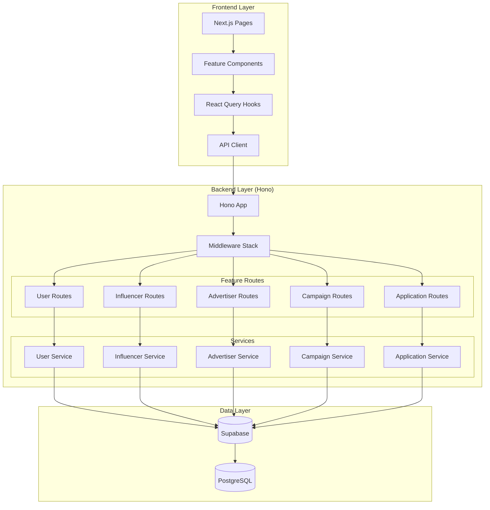

# 블로그 체험단 SaaS — 모듈화 설계 및 구현 계획

## 개요

### 1. Shared Modules (공통 모듈)

| 모듈 | 위치 | 설명 |
|------|------|------|
| Auth Core | `src/features/auth/*` | Supabase Auth 기반 인증/세션 관리 (이미 구현됨) |
| API Client | `src/lib/remote/api-client.ts` | Axios 기반 HTTP 클라이언트 (이미 구현됨) |
| Form Components | `src/components/ui/form.tsx` 등 | shadcn-ui 기반 폼 컴포넌트 (이미 구현됨) |
| Profile Guard | `src/features/profile/lib/guard.ts` | 역할별 프로필 등록 여부 가드 (신규) |

### 2. Feature Modules (기능 모듈)

#### 2.1 Users & Profiles
| 모듈 | 위치 | 설명 |
|------|------|------|
| User Registration | `src/features/user/*` | 회원가입, 약관동의 처리 |
| Influencer Profile | `src/features/influencer/*` | 인플루언서 프로필 등록/관리 |
| Advertiser Profile | `src/features/advertiser/*` | 광고주 프로필 등록/관리 |

#### 2.2 Campaigns
| 모듈 | 위치 | 설명 |
|------|------|------|
| Campaign List | `src/features/campaign/components/campaign-list.tsx` | 체험단 목록 조회 |
| Campaign Detail | `src/features/campaign/components/campaign-detail.tsx` | 체험단 상세 조회 |
| Campaign Management | `src/features/campaign/components/campaign-management.tsx` | 광고주 체험단 관리 |

#### 2.3 Applications
| 모듈 | 위치 | 설명 |
|------|------|------|
| Application Form | `src/features/application/components/application-form.tsx` | 체험단 지원 |
| Application List | `src/features/application/components/application-list.tsx` | 내 지원 목록 |
| Selection Process | `src/features/application/components/selection-dialog.tsx` | 광고주 선정 프로세스 |

### 3. Pages (라우팅)

| 페이지 | 경로 | 설명 |
|--------|------|------|
| Home | `src/app/page.tsx` | 홈 & 체험단 목록 탐색 |
| Login | `src/app/login/page.tsx` | 로그인 (이미 구현됨) |
| Signup | `src/app/signup/page.tsx` | 회원가입 |
| Onboarding | `src/app/onboarding/page.tsx` | 역할별 온보딩 (인플루언서/광고주 정보 등록) |
| Campaign Detail | `src/app/campaigns/[id]/page.tsx` | 체험단 상세 |
| Apply | `src/app/campaigns/[id]/apply/page.tsx` | 체험단 지원 |
| My Applications | `src/app/my-applications/page.tsx` | 내 지원 목록 |
| Dashboard (Advertiser) | `src/app/dashboard/page.tsx` | 광고주 체험단 관리 |
| Campaign Detail (Advertiser) | `src/app/dashboard/campaigns/[id]/page.tsx` | 광고주 체험단 상세 |

---

## Architecture Diagram



---

## Implementation Plan

### Phase 1: Foundation (공통 모듈 및 인프라)

#### 1.1 Profile Guard Module
**위치**: `src/features/profile/lib/guard.ts`

**목적**: 역할별 프로필 등록 여부 확인 및 접근 제어

**구현 사항**:
```typescript
// 인플루언서 프로필 등록 여부 확인
export const checkInfluencerProfile = async (userId: string) => Promise<boolean>

// 광고주 프로필 등록 여부 확인
export const checkAdvertiserProfile = async (userId: string) => Promise<boolean>

// 역할별 리디렉션 URL 반환
export const getProfileRedirectUrl = (role: 'influencer' | 'advertiser', hasProfile: boolean) => string
```

**Unit Test**:
- ✓ 프로필 존재 시 true 반환
- ✓ 프로필 미존재 시 false 반환
- ✓ 올바른 리디렉션 URL 반환
- ✓ 에러 발생 시 적절한 예외 처리

---

### Phase 2: User & Auth (회원가입 및 역할 선택)

#### 2.1 Backend - User Registration
**위치**: `src/features/user/backend/*`

**파일 구조**:
- `route.ts`: POST /api/users/signup
- `service.ts`: createUser, saveTermsAgreement
- `schema.ts`: SignupRequestSchema, SignupResponseSchema
- `error.ts`: USER_ALREADY_EXISTS, INVALID_ROLE 등

**API 스펙**:
```typescript
POST /api/users/signup
Request: {
  email: string;
  password: string;
  name: string;
  phone: string;
  role: 'advertiser' | 'influencer';
  termsAgreed: string[]; // ['service', 'privacy']
}
Response: {
  userId: string;
  role: string;
}
```

**Unit Test**:
- ✓ 정상 회원가입 시 users, terms_agreements 테이블에 데이터 저장
- ✓ 중복 이메일 시 409 Conflict
- ✓ 약관 미동의 시 400 Bad Request
- ✓ 잘못된 역할 값 시 400 Bad Request

#### 2.2 Frontend - Signup Page
**위치**: `src/app/signup/page.tsx`

**QA Sheet**:
| 시나리오 | 입력 | 기대 결과 |
|----------|------|-----------|
| 정상 회원가입 | 모든 필드 유효 입력 | 역할별 온보딩 페이지로 리디렉션 |
| 이메일 중복 | 기존 이메일 입력 | "이미 가입된 이메일입니다" 에러 메시지 |
| 약관 미동의 | 약관 체크 안 함 | 제출 버튼 비활성화 |
| 비밀번호 불일치 | 비밀번호 확인 불일치 | "비밀번호가 일치하지 않습니다" 에러 메시지 |

---

### Phase 3: Profile Management (역할별 프로필 등록)

#### 3.1 Backend - Influencer Profile
**위치**: `src/features/influencer/backend/*`

**API 스펙**:
```typescript
POST /api/influencers/profile
Request: {
  birthDate: string; // ISO 8601
  channels: Array<{
    platform: 'naver' | 'youtube' | 'instagram' | 'threads';
    channelName: string;
    channelUrl: string;
  }>;
}
Response: {
  influencerId: number;
  channels: Array<{ id: number; verificationStatus: string }>;
}

GET /api/influencers/profile/me
Response: {
  influencerId: number;
  birthDate: string;
  channels: Array<{...}>;
}
```

**Unit Test**:
- ✓ 정상 프로필 등록 시 influencer_profiles, influencer_channels 저장
- ✓ 중복 프로필 등록 시 409 Conflict (user_id UNIQUE)
- ✓ 만 14세 미만 시 400 Bad Request
- ✓ 채널 최소 1개 필수
- ✓ URL 형식 검증

#### 3.2 Backend - Advertiser Profile
**위치**: `src/features/advertiser/backend/*`

**API 스펙**:
```typescript
POST /api/advertisers/profile
Request: {
  businessName: string;
  location: string;
  category: string;
  businessRegistrationNumber: string;
}
Response: {
  advertiserId: number;
}

GET /api/advertisers/profile/me
Response: {
  advertiserId: number;
  businessName: string;
  location: string;
  category: string;
  businessRegistrationNumber: string;
}
```

**Unit Test**:
- ✓ 정상 프로필 등록 시 advertiser_profiles 저장
- ✓ 중복 사업자등록번호 시 409 Conflict
- ✓ 사업자번호 형식 검증 (10자리 숫자)

#### 3.3 Frontend - Onboarding Page
**위치**: `src/app/onboarding/page.tsx`

**컴포넌트**:
- `InfluencerOnboarding`: 생년월일 입력, SNS 채널 추가/편집/삭제
- `AdvertiserOnboarding`: 업체명, 위치, 카테고리, 사업자등록번호 입력

**QA Sheet**:
| 시나리오 | 입력 | 기대 결과 |
|----------|------|-----------|
| 인플루언서 정상 등록 | 모든 필드 입력 + 채널 1개 이상 | 홈으로 리디렉션 |
| 채널 미등록 | 채널 0개 | "최소 1개 이상의 채널을 등록해주세요" 에러 |
| 광고주 정상 등록 | 모든 필드 입력 | 체험단 관리 페이지로 리디렉션 |
| 사업자번호 중복 | 기존 사업자번호 입력 | "이미 등록된 사업자번호입니다" 에러 |

---

### Phase 4: Campaign Management (체험단 관리)

#### 4.1 Backend - Campaign Routes
**위치**: `src/features/campaign/backend/*`

**API 스펙**:
```typescript
GET /api/campaigns?status=recruiting
Response: {
  campaigns: Array<{
    id: number;
    title: string;
    recruitmentStartDate: string;
    recruitmentEndDate: string;
    maxParticipants: number;
    benefits: string;
    storeInfo: string;
    status: 'recruiting' | 'closed' | 'selected';
  }>;
}

GET /api/campaigns/:id
Response: { /* 상세 정보 */ }

POST /api/campaigns (광고주 전용)
Request: {
  title: string;
  recruitmentStartDate: string;
  recruitmentEndDate: string;
  maxParticipants: number;
  benefits: string;
  storeInfo: string;
  mission: string;
}
Response: { campaignId: number; }

PATCH /api/campaigns/:id/close (광고주 전용)
Response: { status: 'closed' }

GET /api/campaigns/me (광고주 전용)
Response: { campaigns: [...] }
```

**Unit Test**:
- ✓ 모집 중 캠페인 목록 조회
- ✓ 캠페인 상세 조회 (존재하지 않는 ID 시 404)
- ✓ 광고주만 캠페인 등록 가능 (인플루언서 시 403)
- ✓ 모집 기간 검증 (시작일 < 종료일)
- ✓ 모집 인원 최소값 검증 (> 0)
- ✓ 모집 종료 (status → closed)

#### 4.2 Frontend - Campaign Pages
**위치**: `src/app/campaigns/*`, `src/features/campaign/components/*`

**컴포넌트**:
- `CampaignList`: 체험단 카드 리스트
- `CampaignDetail`: 체험단 상세 정보
- `CampaignForm`: 체험단 등록 Dialog
- `CampaignManagement`: 광고주 대시보드

**QA Sheet**:
| 시나리오 | 입력 | 기대 결과 |
|----------|------|-----------|
| 홈 페이지 접속 | - | 모집 중 체험단 목록 표시 |
| 체험단 카드 클릭 | - | 상세 페이지로 이동 |
| 광고주 캠페인 등록 | 모든 필드 입력 | 목록에 신규 캠페인 추가 |
| 모집 종료 버튼 클릭 | - | 상태 "모집종료"로 변경 |
| 비로그인 상태 지원 버튼 | - | 로그인 페이지로 리디렉션 |

---

### Phase 5: Application Process (체험단 지원)

#### 5.1 Backend - Application Routes
**위치**: `src/features/application/backend/*`

**API 스펙**:
```typescript
POST /api/applications (인플루언서 전용)
Request: {
  campaignId: number;
  motivation: string;
  visitDate: string;
}
Response: { applicationId: number; status: 'pending' }

GET /api/applications/me?status=pending (인플루언서 전용)
Response: {
  applications: Array<{
    id: number;
    campaign: { id: number; title: string; };
    motivation: string;
    visitDate: string;
    status: 'pending' | 'selected' | 'rejected';
    createdAt: string;
  }>;
}

GET /api/campaigns/:id/applications (광고주 전용)
Response: {
  applications: Array<{
    id: number;
    influencer: { name: string; email: string; };
    motivation: string;
    visitDate: string;
    status: string;
  }>;
}

POST /api/campaigns/:id/select (광고주 전용)
Request: {
  selectedApplicationIds: number[];
}
Response: { success: true }
```

**Unit Test**:
- ✓ 정상 지원 시 applications 저장 (status=pending)
- ✓ 중복 지원 시 409 Conflict (UNIQUE 제약)
- ✓ 모집 종료된 캠페인 지원 시 400 Bad Request
- ✓ 내 지원 목록 조회 (본인 것만)
- ✓ 광고주 지원자 목록 조회 (본인 캠페인만)
- ✓ 선정 프로세스: 선택된 지원자 selected, 나머지 rejected, 캠페인 상태 selected

#### 5.2 Frontend - Application Pages
**위치**: `src/app/campaigns/[id]/apply/page.tsx`, `src/features/application/components/*`

**컴포넌트**:
- `ApplicationForm`: 각오 한마디, 방문 예정일 입력
- `ApplicationList`: 내 지원 목록
- `ApplicationTable`: 광고주 지원자 테이블
- `SelectionDialog`: 선정 인원 선택 Dialog

**QA Sheet**:
| 시나리오 | 입력 | 기대 결과 |
|----------|------|-----------|
| 정상 지원 | 각오 + 방문일 입력 | "지원 완료" 메시지, 내 지원 목록으로 이동 |
| 중복 지원 | 이미 지원한 캠페인 | "이미 지원한 체험단입니다" 에러 |
| 내 지원 목록 필터 | status=selected 선택 | 선정된 지원 목록만 표시 |
| 광고주 선정 프로세스 | 3명 선택 | 3명 "선정", 나머지 "반려", 캠페인 "선정완료" |
| 선정 인원 0명 | 아무도 선택 안 함 | "최소 1명을 선택해주세요" 에러 |

---

## Shared Utilities & Types

### 1. Common Schemas
**위치**: `src/lib/schemas/common.ts`

```typescript
export const DateSchema = z.string().refine((date) => !isNaN(Date.parse(date)), {
  message: "Invalid date format",
});

export const UUIDSchema = z.string().uuid();

export const PhoneSchema = z.string().regex(/^01[0-9]-?[0-9]{4}-?[0-9]{4}$/);

export const RoleSchema = z.enum(['advertiser', 'influencer']);
```

### 2. Common Hooks
**위치**: `src/hooks/useAuth.ts`

```typescript
export const useAuth = () => {
  const { user, isAuthenticated } = useCurrentUser();
  const router = useRouter();

  const requireAuth = useCallback(() => {
    if (!isAuthenticated) {
      router.push('/login?redirectedFrom=' + window.location.pathname);
    }
  }, [isAuthenticated, router]);

  return { user, isAuthenticated, requireAuth };
};
```

### 3. Common Components
**위치**: `src/components/shared/*`

- `RoleGuard`: 역할별 접근 제어 컴포넌트
- `ProfileCompleteGuard`: 프로필 등록 완료 여부 가드
- `LoadingSpinner`: 공통 로딩 인디케이터
- `ErrorMessage`: 공통 에러 메시지 컴포넌트

---

## Implementation Order

### Sprint 1 (Foundation)
1. Profile Guard Module
2. Common Schemas & Types
3. Common Hooks & Components

### Sprint 2 (Auth & Profile)
1. User Registration Backend
2. Signup Page
3. Influencer Profile Backend & Frontend
4. Advertiser Profile Backend & Frontend
5. Onboarding Page

### Sprint 3 (Campaign)
1. Campaign Backend (CRUD)
2. Campaign List & Detail Pages
3. Campaign Management (Advertiser Dashboard)
4. Campaign Form Dialog

### Sprint 4 (Application)
1. Application Backend (지원, 조회)
2. Application Form Page
3. My Applications Page
4. Application Table & Selection Dialog (Advertiser)

### Sprint 5 (Integration & Polish)
1. E2E 시나리오 테스트
2. 에러 핸들링 개선
3. UX 개선 (로딩, 빈 상태, 에러 상태)
4. 접근성 개선

---

## Testing Strategy

### Backend Unit Tests
- Service Layer: 각 서비스 메서드별 단위 테스트
- Schema Validation: zod 스키마 검증 테스트
- Error Handling: 에러 코드 및 메시지 검증

### Frontend Component Tests
- Form Validation: react-hook-form 검증 로직 테스트
- User Interaction: 버튼 클릭, 입력 이벤트 시뮬레이션
- Conditional Rendering: 상태별 UI 렌더링 검증

### Integration Tests
- API 통합: 프론트 → 백엔드 → DB 전체 플로우
- 인증 플로우: 로그인 → 프로필 등록 → 기능 접근
- 권한 검증: 역할별 접근 제어

---

## Deployment Checklist

- [ ] Supabase 마이그레이션 적용
- [ ] 환경 변수 설정 (NEXT_PUBLIC_SUPABASE_URL, SUPABASE_SERVICE_ROLE_KEY)
- [ ] shadcn-ui 컴포넌트 설치 (dialog, table, badge, select 등)
- [ ] 백엔드 라우트 등록 (createHonoApp에 각 feature route 추가)
- [ ] 프론트엔드 라우팅 구성
- [ ] 프로덕션 빌드 테스트
- [ ] 에러 모니터링 설정
