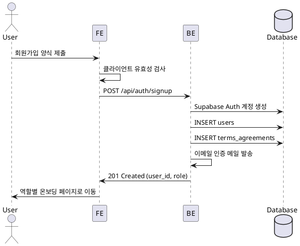
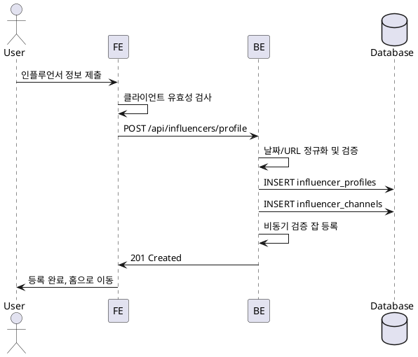
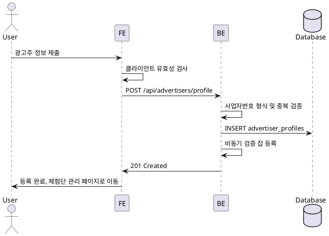
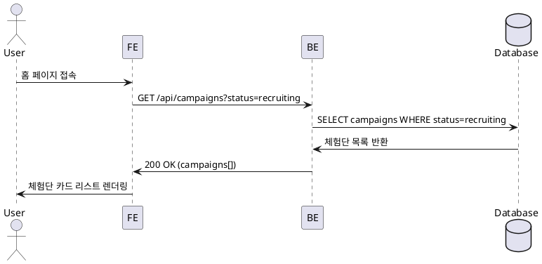
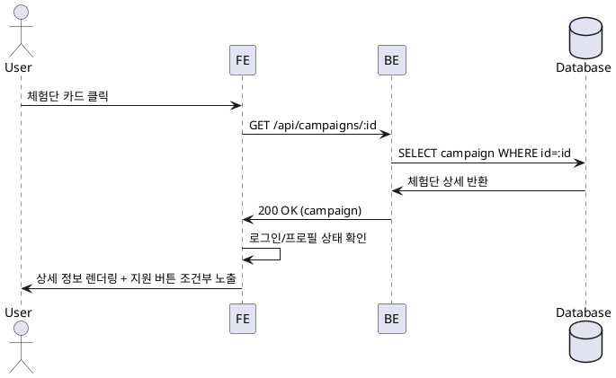
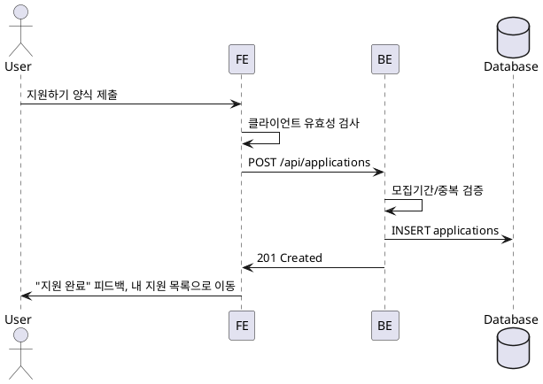
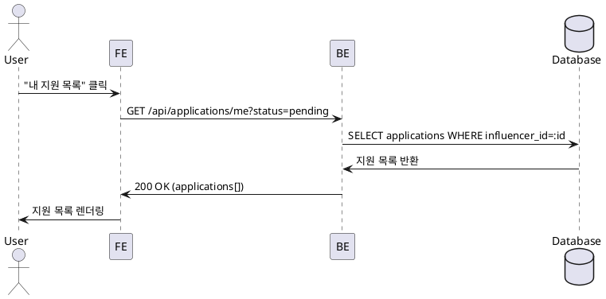
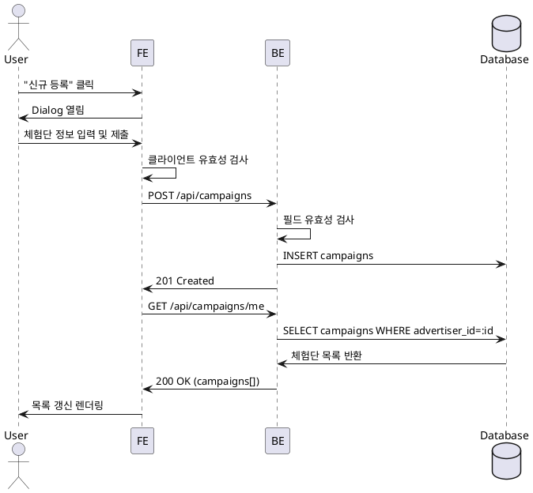
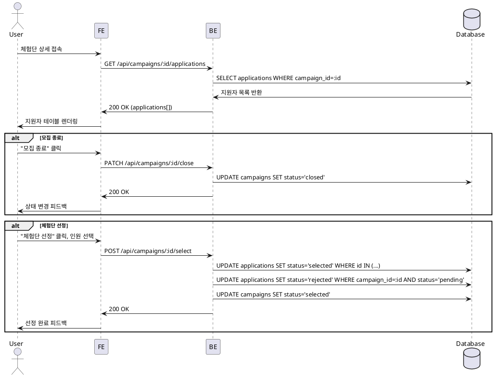

# 블로그 체험단 SaaS — 유스케이스 상세 명세

## UC-01: 회원가입 & 역할선택

**Primary Actor**: 신규 사용자

**Precondition**: 없음

**Trigger**: 회원가입 페이지 접속 및 양식 제출

**Main Scenario**:
1. 사용자가 이름, 휴대폰번호, 이메일 입력
2. 사용자가 역할(광고주/인플루언서) 선택
3. 사용자가 약관 동의 체크
4. 제출 → Supabase Auth로 계정 생성
5. users 테이블에 프로필 레코드 생성
6. terms_agreements 테이블에 약관 동의 이력 저장
7. 이메일 인증 메일 발송
8. 역할별 온보딩 페이지로 리디렉션

**Edge Cases**:
- 이메일 중복: 이미 가입된 이메일 에러 반환
- 유효하지 않은 이메일/전화번호 형식: 클라이언트 유효성 검사 실패
- 레이트 리밋 초과: 429 Too Many Requests

**Business Rules**:
- 이메일은 Supabase Auth로 관리
- 역할은 회원가입 시점에 결정되며 변경 불가
- 약관 동의는 필수

---

## UC-02: 인플루언서 정보 등록

**Primary Actor**: 인플루언서 역할 사용자

**Precondition**: 회원가입 완료, role=influencer

**Trigger**: 온보딩 또는 프로필 등록 페이지 접속 후 제출

**Main Scenario**:
1. 사용자가 생년월일 입력
2. 사용자가 SNS 채널(플랫폼, 채널명, URL) 추가
3. 제출 → 백엔드로 전송
4. 날짜/URL 형식 검증 및 정규화
5. influencer_profiles 테이블에 생년월일 저장
6. influencer_channels 테이블에 채널 정보 저장 (verification_status=pending)
7. 비동기 검증 잡 큐 등록 (선택 구현)
8. 성공 피드백 및 홈으로 리디렉션

**Edge Cases**:
- 나이 제한 위반: 만 14세 미만 가입 불가 등
- URL 형식 오류: 400 Bad Request
- 중복 프로필 등록 방지: user_id UNIQUE 제약

**Business Rules**:
- 최소 1개 이상의 SNS 채널 등록 필수
- 채널 검증은 비동기로 처리, 검증 실패 시에도 지원 가능 (정책에 따라 변경 가능)
- 생년월일은 필수 입력

---

## UC-03: 광고주 정보 등록

**Primary Actor**: 광고주 역할 사용자

**Precondition**: 회원가입 완료, role=advertiser

**Trigger**: 온보딩 또는 프로필 등록 페이지 접속 후 제출

**Main Scenario**:
1. 사용자가 업체명, 위치, 카테고리, 사업자등록번호 입력
2. 제출 → 백엔드로 전송
3. 사업자등록번호 형식 검증 및 중복 확인
4. advertiser_profiles 테이블에 저장
5. 외부 사업자번호 검증 잡 큐 등록 (선택 구현)
6. 성공 피드백 및 체험단 관리 대시보드로 리디렉션

**Edge Cases**:
- 사업자등록번호 중복: 409 Conflict
- 형식 오류: 400 Bad Request
- 레이트 리밋 초과: 429 Too Many Requests

**Business Rules**:
- 사업자등록번호는 고유값
- 위치/카테고리는 자유 입력 또는 선택형 (구현 정책에 따라)
- 프로필 등록 완료 시 체험단 등록 권한 부여

---

## UC-04: 홈 & 체험단 목록 탐색

**Primary Actor**: 모든 사용자 (비로그인 포함)

**Precondition**: 없음

**Trigger**: 홈 페이지 접속

**Main Scenario**:
1. 사용자가 홈 접속
2. 백엔드에서 모집 중(status=recruiting) 체험단 목록 조회
3. 최신순 정렬, 페이징 적용
4. 배너/공지사항 로드 (선택)
5. 체험단 카드 리스트 렌더링

**Edge Cases**:
- 모집 중인 체험단 없음: 빈 리스트 표시
- 네트워크 오류: 재시도 UI 또는 에러 메시지

**Business Rules**:
- 모집 기간이 지난 캠페인은 자동으로 필터링되지 않음 (status 기준)
- 비로그인 사용자도 목록 조회 가능

---

## UC-05: 체험단 상세 조회

**Primary Actor**: 모든 사용자

**Precondition**: 없음

**Trigger**: 체험단 카드 클릭

**Main Scenario**:
1. 사용자가 체험단 카드 클릭
2. 백엔드에서 campaign_id로 상세 정보 조회
3. 로그인 상태 및 인플루언서 프로필 등록 여부 확인
4. 체험단 상세(모집기간, 혜택, 미션, 매장정보) 렌더링
5. 조건 충족 시 "지원하기" 버튼 노출

**Edge Cases**:
- 존재하지 않는 campaign_id: 404 Not Found
- 비로그인 사용자: "지원하기" 버튼 대신 로그인 유도
- 인플루언서 정보 미등록: "프로필 등록 필요" 안내

**Business Rules**:
- 인플루언서 프로필 등록 완료자만 지원 가능
- 광고주는 지원 불가 (UI에서 버튼 숨김)

---

## UC-06: 체험단 지원

**Primary Actor**: 인플루언서

**Precondition**: 로그인, 인플루언서 프로필 등록 완료

**Trigger**: 체험단 상세 페이지에서 "지원하기" 클릭

**Main Scenario**:
1. 사용자가 각오 한마디, 방문 예정일자 입력
2. 제출 → 백엔드로 전송
3. 유효성 검사 (모집기간 내, 중복 지원 방지)
4. applications 테이블에 저장 (status=pending)
5. 성공 피드백 및 "내 지원 목록"으로 리디렉션

**Edge Cases**:
- 중복 지원: 409 Conflict (UNIQUE 제약 위반)
- 모집 기간 종료: 400 Bad Request
- 필수 입력 누락: 400 Bad Request

**Business Rules**:
- 동일 체험단에 1회만 지원 가능
- 모집 기간 종료 후 지원 불가
- 방문 예정일은 현재 날짜 이후여야 함

---

## UC-07: 내 지원 목록 조회

**Primary Actor**: 인플루언서

**Precondition**: 로그인, 인플루언서 프로필 등록 완료

**Trigger**: "내 지원 목록" 메뉴 클릭

**Main Scenario**:
1. 사용자가 메뉴에서 "내 지원 목록" 선택
2. 백엔드에서 본인이 지원한 applications 조회
3. 상태 필터 선택 시 필터 적용 (pending/selected/rejected)
4. 지원 목록 렌더링 (체험단명, 지원일, 상태)

**Edge Cases**:
- 지원 내역 없음: 빈 리스트 표시
- 네트워크 오류: 에러 메시지

**Business Rules**:
- 본인이 지원한 목록만 조회 가능
- 상태별 필터링 지원

---

## UC-08: 광고주 체험단 관리

**Primary Actor**: 광고주

**Precondition**: 로그인, 광고주 프로필 등록 완료

**Trigger**: "체험단 관리" 페이지 접속 및 신규 등록

**Main Scenario**:
1. 사용자가 "체험단 관리" 접속
2. 내가 등록한 체험단 목록 조회
3. "신규 등록" 버튼 클릭 → Dialog 열림
4. 체험단명, 모집기간, 모집인원, 혜택, 매장정보, 미션 입력
5. 제출 → 백엔드로 전송
6. campaigns 테이블에 저장 (status=recruiting)
7. 목록 갱신

**Edge Cases**:
- 필수 입력 누락: 400 Bad Request
- 모집 시작일 > 종료일: 400 Bad Request
- 모집 인원 < 1: 400 Bad Request

**Business Rules**:
- 광고주만 체험단 등록 가능
- 신규 등록 시 status=recruiting 자동 설정
- 모집 기간은 현재 날짜 이후여야 함

---

## UC-09: 광고주 체험단 상세 & 모집 관리

**Primary Actor**: 광고주

**Precondition**: 로그인, 광고주 프로필 등록 완료, 본인이 등록한 체험단

**Trigger**: 체험단 상세 페이지 접속 및 모집 상태 변경

**Main Scenario (모집 종료)**:
1. 사용자가 체험단 상세 접속
2. 지원자 목록 조회
3. "모집 종료" 버튼 클릭
4. campaigns.status → 'closed' 업데이트
5. 상태 변경 피드백

**Main Scenario (체험단 선정)**:
1. status=closed인 체험단 상세 접속
2. "체험단 선정" 버튼 클릭 → 선정 Dialog 열림
3. 지원자 테이블에서 선정 인원 체크박스 선택
4. 제출 → 백엔드로 전송
5. 선정된 applications.status → 'selected' 업데이트
6. 나머지 applications.status → 'rejected' 업데이트
7. campaigns.status → 'selected' 업데이트
8. 선정 완료 피드백

**Edge Cases**:
- 지원자 없음: 모집 종료만 가능, 선정 불가
- 선정 인원 0명: 400 Bad Request
- 이미 선정 완료된 체험단: 중복 선정 방지

**Business Rules**:
- status=recruiting → closed → selected 순차 진행
- 선정된 인원 외 모든 지원자는 자동 반려
- 본인이 등록한 체험단만 관리 가능

---

## 공통 Edge Cases

- **인증 오류**: 401 Unauthorized (로그인 필요)
- **권한 오류**: 403 Forbidden (접근 권한 없음)
- **네트워크 오류**: 클라이언트에서 재시도 또는 에러 메시지
- **서버 오류**: 500 Internal Server Error, 로그 기록 및 사용자에게 일반 에러 메시지
